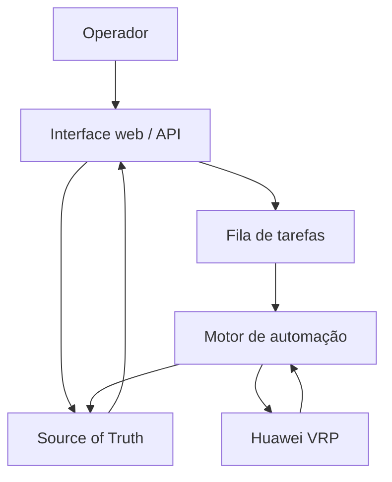

# Gerenciador de Rede Huawei VRP

## 1. Visão geral

O projeto consiste em uma plataforma web para cadastrar, provisionar, validar, auditar e manter serviços de rede em equipamentos Huawei VRP.

O foco inicial será:

- gerenciamento de downstreams e upstreams BGP em um ou mais roteadores Huawei NE8000;
- provisionamento IPv4, IPv6 e dual stack;
- criação e manutenção de VLANs e interfaces de comunicação;
- geração de filtros, políticas e sessões BGP;
- gerenciamento de serviços MPLS em switches Huawei, incluindo L2VC e VSI;
- coleta de estado operacional e comparação entre a intenção registrada e a configuração existente;
- aplicação controlada de alterações com pré-validação, aprovação, auditoria e pós-validação.

A plataforma não deve ser apenas um executor de comandos SSH. O banco de dados deve representar a **intenção da rede**, enquanto a configuração coletada dos equipamentos representa o **estado real**. O sistema deve comparar ambos e indicar se o serviço está sincronizado, divergente, pendente, degradado ou com erro.

---

## 2. Objetivos

### 2.1 Objetivos principais

1. Padronizar o provisionamento de clientes downstream.
2. Padronizar o gerenciamento de upstreams.
3. Reduzir erros manuais em VLANs, endereçamento, filtros e sessões BGP.
4. Automatizar serviços MPLS L2VC e VSI entre switches Huawei.
5. Manter histórico completo das alterações.
6. Permitir validação antes e depois de cada mudança.
7. Detectar divergências entre banco de dados e equipamentos.
8. Oferecer operação segura, repetível e auditável.

### 2.2 Fora do escopo inicial

- substituir totalmente o NMS ou o Zabbix;
- configuração genérica de qualquer fabricante;
- mudanças automáticas sem política de aprovação;
- descoberta e alteração irrestrita de qualquer comando do equipamento;
- gerenciamento completo de OLTs, BNG ou CGNAT.

Esses itens poderão ser adicionados posteriormente como módulos independentes.

---

## 3. Princípios da solução

### 3.1 Source of Truth

O PostgreSQL será a fonte de verdade da intenção da rede. Nele ficarão armazenados clientes, equipamentos, interfaces, VLANs, endereços, ASNs, políticas, sessões BGP e serviços MPLS.

O sistema nunca deve assumir que o banco corresponde ao estado do equipamento. Antes de aplicar uma mudança, deverá consultar o dispositivo e comparar:

- estado desejado;
- estado encontrado;
- comandos necessários para convergência;
- possíveis conflitos ou impactos.

### 3.2 Mudanças idempotentes

Executar a mesma operação mais de uma vez não deverá duplicar regras, peers, interfaces ou serviços. O sistema deverá reconhecer objetos já existentes e gerar somente a diferença necessária.

### 3.3 Segurança por padrão

Toda alteração deverá seguir o fluxo:

1. validar os dados cadastrados;
2. coletar o estado atual;
3. verificar conflitos;
4. gerar o plano de mudança;
5. apresentar o diff e os comandos;
6. exigir aprovação conforme a política;
7. criar backup ou checkpoint;
8. aplicar a mudança;
9. validar o resultado;
10. registrar a auditoria.

### 3.4 Separação entre intenção e implementação

Os objetos de negócio não devem armazenar blocos soltos de CLI como dado principal. Um downstream deve ser descrito por campos estruturados. Templates específicos por plataforma e versão do VRP transformarão esses dados em configuração.

---

## 4. Arquitetura proposta

### 4.1 Componentes

| Componente | Responsabilidade |
|---|---|
| Interface web | Cadastro, visualização, aprovação, auditoria e acompanhamento de tarefas |
| API | Regras de negócio, validação, autenticação e integração externa |
| PostgreSQL | Source of Truth, inventário, serviços, histórico e auditoria |
| Worker | Execução assíncrona de coleta, validação e provisionamento |
| Nornir | Inventário em tempo de execução, filtros, concorrência e organização das tarefas |
| Netmiko | Comunicação SSH/CLI com equipamentos Huawei VRP |
| NETCONF | Canal estruturado opcional para modelos e versões compatíveis |
| Jinja2 | Templates de configuração Huawei VRP versionados |
| Redis | Fila, locks e estado temporário de tarefas, caso Celery/RQ seja utilizado |
| Vault/Secrets | Armazenamento seguro de credenciais e chaves |
| Git | Versionamento dos templates, parsers, políticas e código |

### 4.2 Stack sugerida

- Backend: Python com FastAPI;
- ORM e migrações: SQLAlchemy e Alembic;
- Banco: PostgreSQL;
- Automação: Nornir, Netmiko e Jinja2;
- Parsing: TextFSM, TTP ou parsers próprios testados;
- Tarefas assíncronas: Celery ou RQ com Redis;
- Frontend: React/Next.js ou interface server-side inicialmente;
- Autenticação: usuários locais no MVP, evoluindo para OIDC/LDAP;
- Implantação: Docker Compose inicialmente;
- Observabilidade: logs estruturados, Prometheus e integração com Zabbix/Grafana.

### 4.3 Fluxo lógico



---

## 5. Inventário de equipamentos

Cada equipamento deverá possuir:

- nome único;
- hostname ou endereço de gerenciamento;
- fabricante;
- modelo;
- família: NE8000, NE40, S6730 etc.;
- versão do VRP;
- função: core, route reflector, PE, switch MPLS, borda ou agregação;
- site/cidade/POP;
- loopback/router-id;
- ASN local quando aplicável;
- domínio de MPLS;
- grupo de credencial;
- método de acesso: SSH e/ou NETCONF;
- porta de acesso;
- status administrativo;
- status de comunicação;
- data da última coleta;
- tags livres.

As credenciais não deverão ser armazenadas diretamente no registro do equipamento. O equipamento deverá referenciar um grupo de credenciais mantido em armazenamento seguro.

### 5.1 Capacidades por equipamento

O sistema deverá manter capacidades detectadas ou cadastradas, como:

- suporte a IPv4 e IPv6;
- suporte a NETCONF;
- suporte a commit/rollback;
- suporte a configuration replace;
- sintaxe de route-policy ou XPL;
- MPLS LDP habilitado;
- tipos de serviço suportados;
- limites de nome, descrição e número de regras.

Isso evita gerar comandos incompatíveis com determinada família ou versão do VRP.

---

## 6. Gerenciamento de downstreams

### 6.1 Cadastro do cliente

O cadastro deverá conter:

- razão social e nome de exibição;
- identificador interno;
- status comercial e operacional;
- contatos técnicos;
- ASN do cliente;
- IRR AS-SET, quando existente;
- prefixos IPv4 e IPv6 autorizados;
- quantidade máxima de prefixos;
- POP de atendimento;
- roteador de borda;
- switch de acesso;
- porta física ou Eth-Trunk;
- descrição padronizada;
- tipo de serviço: IPv4, IPv6 ou dual stack;
- observações e anexos.

### 6.2 Circuito de comunicação

Um cliente poderá ter um ou mais circuitos. Cada circuito deverá permitir:

- VLAN única para dual stack;
- VLAN separada para IPv4 e IPv6;
- QinQ, quando necessário;
- interface física, subinterface ou Eth-Trunk;
- MTU;
- banda contratada;
- endereços IPv4 local e remoto;
- prefixo IPv4, normalmente `/30` ou `/31`;
- endereços IPv6 local e remoto;
- prefixo IPv6, normalmente `/64` ou outro definido pela operação;
- VRF/VS, caso aplicável;
- roteador principal e roteador de contingência;
- BFD opcional;
- status de implantação.

O sistema deverá validar se VLANs e endereços já estão em uso no mesmo domínio.

### 6.3 Sessão BGP downstream

Para cada família de endereço, deverão ser configuráveis:

- equipamento local;
- endereço local e remoto;
- ASN local e ASN remoto;
- endereço de origem da sessão;
- descrição;
- AFI/SAFI IPv4 unicast e/ou IPv6 unicast;
- route-policy de importação;
- route-policy de exportação;
- prefix-list/ip-prefix de entrada;
- prefix-list/ip-prefix de saída;
- AS-PATH filter;
- communities aplicadas;
- local-preference;
- MED;
- prepend;
- maximum-prefix e limiar de alerta;
- timers;
- BFD;
- password, armazenada como segredo;
- graceful restart;
- shutdown administrativo;
- política de default route;
- política de full route ou parcial.

### 6.4 Filtros de entrada do downstream

Por padrão, o sistema deverá oferecer proteção contra:

- prefixos não autorizados para o cliente;
- bogons e martians;
- default route não autorizada;
- prefixos mais específicos que o limite definido;
- ASN incorreto na origem;
- trânsito indevido no AS-PATH;
- excesso de prefixos;
- rotas próprias da operadora recebidas do downstream;
- comunidades não autorizadas.

Os prefixos autorizados deverão poder ser cadastrados manualmente ou obtidos de uma fonte IRR/RPKI, mantendo aprovação humana antes de alterar filtros de produção.

### 6.5 Políticas de saída para downstream

O operador deverá selecionar o produto de roteamento:

- somente default route;
- default route mais rotas internas;
- tabela parcial;
- full routing;
- rotas de CDN;
- conjunto personalizado de prefixos.

A plataforma deverá construir a política de saída com base no produto, evitando edição manual de route-policy por cliente.

### 6.6 Estados do provisionamento

Um downstream poderá estar em:

- rascunho;
- aguardando validação;
- pronto para provisionar;
- aguardando aprovação;
- provisionando;
- ativo e sincronizado;
- ativo com divergência;
- degradado;
- suspenso;
- em desativação;
- desativado;
- erro.

---

## 7. Gerenciamento de upstreams

O cadastro de upstream deverá reutilizar o modelo de circuitos e sessões BGP, com campos adicionais:

- operadora;
- tipo: trânsito, IX, PNI ou contingência;
- capacidade contratada;
- prioridade;
- custo interno;
- política de preferência de entrada;
- política de anúncio de saída;
- comunidades aceitas pela operadora;
- communities de blackhole;
- communities de prepend por região;
- limite esperado de prefixos;
- recebimento de full route, parcial ou default;
- validação RPKI;
- regras para clientes, membros e prefixos próprios;
- política de contingência.

### 7.1 Proteções recomendadas

- maximum-prefix com margem configurável;
- rejeição de bogons;
- rejeição de rotas próprias;
- filtro de prefixos excessivamente específicos;
- validação do primeiro ASN quando aplicável;
- políticas explícitas de importação e exportação;
- bloqueio padrão quando nenhuma política estiver vinculada;
- alerta de variação anormal na quantidade de rotas;
- registro do número de rotas antes e depois de alterações.

---

## 8. Plano de políticas e nomenclatura

A plataforma deverá trabalhar com objetos reutilizáveis:

- política de importação;
- política de exportação;
- conjunto de bogons;
- conjunto de prefixos próprios;
- conjunto de prefixos do cliente;
- conjunto de communities;
- política de local-preference;
- política de prepend;
- política de blackhole;
- política de RPKI;
- perfil de timers e BFD.

Exemplo de nomenclatura:

```text
PEER-DOWN-<CLIENTE>-V4
PEER-DOWN-<CLIENTE>-V6
IP-PFX-<CLIENTE>-IN-V4
IP-PFX-<CLIENTE>-IN-V6
RP-<CLIENTE>-IMPORT-V4
RP-<CLIENTE>-EXPORT-V4
RP-<CLIENTE>-IMPORT-V6
RP-<CLIENTE>-EXPORT-V6
```

Os nomes deverão ser normalizados para respeitar limites do Huawei VRP. O sistema deverá mostrar o nome lógico e o nome efetivamente utilizado no equipamento.

---

## 9. Gerenciamento MPLS nos switches

### 9.1 Domínio MPLS

O sistema deverá conhecer:

- PEs participantes;
- loopbacks LDP;
- interfaces do core;
- estado de MPLS e LDP;
- peers LDP;
- MTU do core;
- IDs já utilizados;
- VLANs e portas ocupadas;
- serviços existentes.

### 9.2 Serviço L2VC

Um serviço L2VC deverá conter:

- nome do serviço;
- cliente ou finalidade;
- equipamento A e equipamento B;
- interface de acesso em cada ponta;
- VLAN/subinterface em cada ponta;
- encapsulamento dot1q ou QinQ;
- IP do peer LDP;
- VC-ID;
- MTU;
- control-word;
- flow-label quando suportado;
- descrição;
- status administrativo;
- status operacional;
- política de redundância quando aplicável.

Validações obrigatórias:

- VC-ID não utilizado no mesmo domínio;
- VLAN livre nas interfaces selecionadas;
- peer LDP alcançável;
- MPLS/LDP operacional no caminho;
- MTU compatível de ponta a ponta;
- ausência de binding conflitante;
- configuração simétrica entre as pontas.

### 9.3 Serviço VSI

Um serviço VSI deverá conter:

- nome lógico e nome VRP;
- VSI-ID;
- tipo de sinalização, inicialmente LDP;
- lista de PEs participantes;
- peers por PE;
- attachment circuits;
- VLANs e subinterfaces vinculadas;
- MTU;
- encapsulamento;
- split-horizon quando aplicável;
- MAC learning;
- limite de MAC;
- status de cada pseudowire;
- status de cada attachment circuit.

O sistema deverá gerar a configuração de todos os equipamentos participantes na mesma mudança lógica. Se uma ponta falhar, o serviço deverá ficar marcado como parcialmente provisionado e exigir reconciliação.

### 9.4 Alocação de identificadores

Deverá existir um módulo IPAM/VLAN/IDAM interno, mesmo que simples, para controlar:

- VLAN IDs por POP, porta ou domínio;
- VC-IDs;
- VSI-IDs;
- endereços IPv4;
- prefixos IPv6;
- route-policy indices;
- números de regras de ACL;
- descrições e nomes reservados.

Uma integração futura poderá delegar endereçamento e VLANs ao NetBox, mas a primeira versão poderá controlar esses recursos no PostgreSQL.

---

## 10. Descoberta e reconciliação

O sistema deverá coletar periodicamente:

- configuração atual relevante;
- interfaces e subinterfaces;
- VLANs;
- peers BGP e seus estados;
- quantidade de prefixos recebidos e anunciados;
- route-policies, ip-prefixes, AS-PATH filters e communities;
- LDP peers;
- L2VCs;
- VSIs e pseudowires;
- alarmes relevantes;
- versão e uptime do equipamento.

Cada objeto deverá apresentar:

- estado desejado;
- estado encontrado;
- último horário de coleta;
- diferenças;
- severidade da divergência;
- ação recomendada.

A reconciliação não deverá corrigir automaticamente configurações em produção no MVP. Ela deverá gerar um plano para aprovação.

---

## 11. Motor de templates

Os templates deverão ser divididos por:

- fabricante;
- família do equipamento;
- versão principal do VRP;
- recurso;
- operação de criação, alteração ou remoção.

Exemplo:

```text
templates/
└── huawei_vrp/
    ├── common/
    ├── ne8000/
    │   ├── bgp_peer.j2
    │   ├── route_policy.j2
    │   └── subinterface.j2
    └── s6730/
        ├── l2vc.j2
        ├── vsi.j2
        └── attachment_circuit.j2
```

Cada template deverá possuir testes automatizados com entradas conhecidas e saída esperada. Alterações em templates deverão passar por revisão e versionamento Git.

---

## 12. Processo de mudança

### 12.1 Planejamento

Ao solicitar uma mudança, o sistema deverá gerar um **Change Plan** contendo:

- motivo;
- solicitante;
- objetos afetados;
- equipamentos afetados;
- dependências;
- configuração atual;
- configuração desejada;
- comandos previstos;
- comandos de rollback;
- testes antes e depois;
- estimativa de impacto;
- janela planejada.

### 12.2 Pré-checks

Exemplos:

- equipamento acessível;
- usuário com privilégio adequado;
- configuração não alterada desde a geração do plano;
- CPU e memória dentro dos limites;
- BGP e MPLS sem alarmes críticos não relacionados;
- VLAN, endereço, VC-ID e VSI-ID disponíveis;
- peer remoto alcançável;
- templates compatíveis com a versão do equipamento;
- nenhuma outra mudança ativa no mesmo equipamento.

### 12.3 Aplicação

O worker deverá:

1. adquirir lock por equipamento;
2. salvar configuração e evidências anteriores;
3. executar comandos em blocos pequenos;
4. identificar erros retornados pelo VRP;
5. interromper em caso de erro crítico;
6. registrar saída completa de forma segura;
7. executar pós-checks;
8. liberar o lock;
9. atualizar o status da mudança.

### 12.4 Rollback

Cada tipo de mudança deverá possuir estratégia explícita:

- comandos inversos gerados pelo sistema;
- rollback nativo/checkpoint quando suportado;
- restauração controlada de configuração;
- rollback manual documentado quando não for seguro automatizar.

O rollback automático somente deverá ocorrer em situações previamente classificadas como seguras. Perda de conectividade com o equipamento não deve disparar comandos adicionais às cegas.

---

## 13. Validações pós-mudança

### 13.1 BGP

- peer no estado Established;
- ASN local e remoto corretos;
- address-family correta;
- políticas vinculadas;
- quantidade de prefixos dentro do esperado;
- prefixos de teste presentes ou ausentes conforme a política;
- nenhuma queda inesperada de outros peers;
- logs sem erros relacionados.

### 13.2 MPLS

- LDP peer operacional;
- L2VC/VSI Up;
- pseudowires operacionais;
- attachment circuits Up;
- aprendizado de MAC quando aplicável;
- MTU consistente;
- ausência de alarmes novos;
- teste de conectividade quando houver ponto de teste disponível.

---

## 14. Modelo de dados inicial

Entidades sugeridas:

| Entidade | Finalidade |
|---|---|
| `sites` | POPs, cidades e locais |
| `devices` | Inventário dos Huawei |
| `device_interfaces` | Portas, Eth-Trunks e subinterfaces |
| `credential_groups` | Referência a credenciais seguras |
| `organizations` | Downstreams, upstreams e parceiros |
| `contacts` | Contatos técnicos e administrativos |
| `circuits` | Circuitos físicos/lógicos de atendimento |
| `vlans` | Reserva e utilização de VLANs |
| `ip_prefixes` | Blocos e endereços IPv4/IPv6 |
| `bgp_sessions` | Sessões BGP por família |
| `bgp_policy_profiles` | Perfis reutilizáveis de política |
| `bgp_prefix_authorizations` | Prefixos autorizados por cliente |
| `communities` | Communities padronizadas |
| `mpls_domains` | Domínios MPLS/LDP |
| `l2vc_services` | Serviços point-to-point |
| `vsi_services` | Serviços multiponto |
| `service_endpoints` | Pontas e attachment circuits |
| `allocations` | VLAN, VC-ID, VSI-ID e outros recursos |
| `device_snapshots` | Estado/configuração coletada |
| `change_requests` | Solicitações de mudança |
| `change_steps` | Etapas e comandos por equipamento |
| `approvals` | Aprovações e recusas |
| `job_runs` | Execuções dos workers |
| `audit_events` | Trilha imutável de auditoria |

### 14.1 Regras importantes do banco

- ASN deverá estar entre valores válidos de 32 bits, respeitando ASNs reservados;
- endereços e prefixos não poderão se sobrepor indevidamente no mesmo domínio;
- VLAN deverá ser única dentro do escopo definido;
- VC-ID e VSI-ID deverão respeitar unicidade por domínio;
- uma sessão BGP não poderá ser duplicada no mesmo equipamento, VRF/VS e família;
- objetos em uso não poderão ser excluídos fisicamente, apenas desativados;
- segredos nunca deverão aparecer em logs, snapshots ou auditorias.

---

## 15. API inicial

Exemplos de recursos:

```text
/api/v1/devices
/api/v1/sites
/api/v1/organizations
/api/v1/downstreams
/api/v1/upstreams
/api/v1/circuits
/api/v1/bgp-sessions
/api/v1/policy-profiles
/api/v1/mpls/l2vc
/api/v1/mpls/vsi
/api/v1/allocations
/api/v1/change-requests
/api/v1/jobs
/api/v1/audit-events
/api/v1/reconciliation
```

Operações que alterem dispositivos deverão criar uma solicitação de mudança. Um `POST` de cadastro não deverá necessariamente executar imediatamente no roteador.

---

## 16. Interface web

### 16.1 Dashboard

- equipamentos online/offline;
- peers BGP ativos e inativos;
- downstreams e upstreams;
- serviços MPLS ativos e degradados;
- divergências detectadas;
- mudanças pendentes de aprovação;
- últimas falhas de automação;
- utilização de VLANs, endereços e IDs.

### 16.2 Assistente de downstream

Fluxo sugerido:

1. selecionar ou cadastrar cliente;
2. informar ASN e prefixos autorizados;
3. selecionar POP, NE8000 e switch;
4. selecionar IPv4, IPv6 ou dual stack;
5. reservar VLAN e endereços;
6. selecionar perfil de roteamento;
7. configurar maximum-prefix, BFD e timers;
8. revisar diagrama lógico;
9. gerar plano e comandos;
10. enviar para aprovação/provisionamento.

### 16.3 Assistente MPLS

Fluxo sugerido:

1. escolher L2VC ou VSI;
2. selecionar domínio MPLS;
3. selecionar equipamentos e interfaces;
4. reservar VLAN, VC-ID ou VSI-ID;
5. configurar MTU e opções;
6. validar LDP e caminho;
7. apresentar configuração de todas as pontas;
8. provisionar e validar o serviço completo.

---

## 17. Controle de acesso

Perfis iniciais:

| Perfil | Permissões |
|---|---|
| Visualizador | Consultar inventário, serviços e estado |
| Operador | Cadastrar objetos e gerar planos |
| Aprovador | Aprovar ou rejeitar mudanças |
| Executor | Executar mudanças aprovadas |
| Administrador | Gerenciar usuários, templates e políticas globais |

Deverá ser possível impedir que a mesma pessoa solicite, aprove e execute uma mudança crítica, se essa separação for habilitada.

---

## 18. Auditoria

Para cada ação, registrar:

- usuário;
- data e hora;
- endereço de origem;
- objeto alterado;
- valores anteriores e novos;
- motivo/ticket;
- aprovação;
- equipamentos envolvidos;
- comandos gerados;
- comandos efetivamente enviados;
- respostas relevantes;
- resultados dos testes;
- resultado do rollback, quando houver.

Passwords, communities sensíveis e tokens deverão ser mascarados.

---

## 19. Segurança operacional

- utilizar conta de automação individualizada ou identificável;
- preferir chave SSH e cofre de segredos;
- limitar comandos permitidos via TACACS quando possível;
- utilizar rede de gerenciamento dedicada;
- validar host keys dos equipamentos;
- criptografar dados sensíveis em repouso;
- nunca armazenar credenciais em YAML, Git ou templates;
- aplicar limite de concorrência por site e por equipamento;
- usar locks para impedir mudanças simultâneas;
- implementar timeout e circuit breaker;
- mascarar dados sensíveis nos logs;
- realizar backups periódicos do banco e dos snapshots;
- manter trilha de auditoria não editável pela operação comum.

---

## 20. Observabilidade e integrações

### 20.1 Métricas

- duração de cada tarefa;
- sucesso/falha por equipamento e tipo de operação;
- equipamentos inalcançáveis;
- mudanças pendentes;
- divergências por severidade;
- peers BGP por estado;
- L2VCs e VSIs por estado;
- idade da última coleta;
- tamanho da fila.

### 20.2 Integrações futuras

- Zabbix para estado e alarmes;
- Grafana para dashboards;
- n8n para notificações e processos;
- Telegram, Slack ou e-mail;
- TACACS para auditoria de acesso;
- NetBox para inventário e IPAM;
- RPKI Validator;
- IRR/RADB;
- sistema comercial/ERP para ativação e suspensão;
- GitLab/GitHub para revisão de templates.

---

## 21. Estratégia de testes

### 21.1 Testes automatizados

- validação de modelos e regras de negócio;
- renderização de templates;
- parsing de comandos `display`;
- geração de configuração de criação e remoção;
- detecção de conflitos;
- idempotência;
- mascaramento de segredos;
- permissões de usuário;
- comportamento de rollback.

### 21.2 Laboratório

Antes de habilitar produção, testar em equipamento ou imagem VRP de laboratório:

- variações entre versões;
- mensagens de erro do CLI;
- tempo de execução;
- quebra de sessão SSH;
- configuração parcial;
- perda de comunicação durante a mudança;
- comandos de remoção;
- rollback;
- concorrência.

### 21.3 Implantação gradual

1. coleta somente leitura;
2. backup e inventário;
3. geração de comandos sem execução;
4. execução em laboratório;
5. execução em um switch não crítico;
6. MPLS com aprovação manual;
7. downstream de teste;
8. produção controlada;
9. upstreams somente após maturidade do módulo BGP.

---

## 22. Roadmap sugerido

### Fase 1 — Inventário e coleta

- cadastro de equipamentos;
- acesso seguro via SSH;
- Nornir e Netmiko;
- execução de comandos somente leitura;
- backup de configuração;
- coleta de interfaces, BGP, LDP, L2VC e VSI;
- auditoria básica.

### Fase 2 — Source of Truth e validação

- cadastro de organizações e circuitos;
- controle de VLANs e endereçamento;
- cadastro de sessões BGP;
- visualização do estado desejado e real;
- detecção de divergências;
- templates e testes.

### Fase 3 — Downstreams

- assistente de provisionamento;
- IPv4, IPv6 e dual stack;
- filtros de entrada e saída;
- maximum-prefix;
- geração de plano, diff e rollback;
- execução aprovada;
- pós-validação BGP.

### Fase 4 — MPLS

- reserva de VC-ID e VSI-ID;
- provisionamento L2VC;
- provisionamento VSI;
- múltiplos endpoints;
- validação de LDP, pseudowire, MTU e MAC.

### Fase 5 — Upstreams e políticas avançadas

- perfis de upstream;
- full routes;
- communities de engenharia de tráfego;
- local-preference e prepend;
- blackhole;
- IRR e RPKI;
- políticas de contingência.

### Fase 6 — Integrações e automação contínua

- Zabbix/Grafana/n8n;
- NetBox opcional;
- reconciliação agendada;
- notificações;
- API para ativação por sistemas externos;
- relatórios operacionais.

---

## 23. MVP recomendado

O MVP deverá ser pequeno o suficiente para ser seguro e utilizável:

1. cadastrar equipamentos Huawei;
2. cadastrar downstreams;
3. cadastrar circuitos dual stack;
4. reservar VLAN e endereços;
5. cadastrar prefixos autorizados;
6. gerar subinterface, filtros e peer BGP no NE8000;
7. mostrar comandos e diff sem executar por padrão;
8. aplicar após aprovação;
9. validar `display bgp peer` e rotas recebidas;
10. manter backup e auditoria;
11. cadastrar e provisionar L2VC entre dois switches;
12. consultar VSI sem provisionamento automático na primeira versão.

Gerenciamento de upstream e VSI multiponto deve entrar depois que o fluxo de downstream e L2VC estiver estável.

---

## 24. Critérios de aceite do MVP

- nenhum segredo armazenado em texto puro no banco ou repositório;
- cadastro completo de um NE8000 e dois switches Huawei;
- conexão e coleta paralela controlada;
- inventário de interfaces e peers;
- detecção de VLAN e endereço duplicados;
- geração correta para IPv4, IPv6 e dual stack;
- políticas BGP sempre explícitas na importação e exportação;
- visualização dos comandos antes da aplicação;
- aprovação registrada;
- backup anterior à mudança;
- aplicação interrompida ao detectar erro do VRP;
- pós-check de BGP ou L2VC;
- histórico completo por cliente, serviço e equipamento;
- possibilidade de gerar configuração de remoção;
- teste de idempotência aprovado.

---

## 25. Decisões registradas (2026-09-02)

As perguntas abaixo estavam em aberto para a implementação e foram resolvidas em sessão de design em 2026-09-02. Cada item mantém a numeração original. Se uma decisão conflitar com o texto de uma seção anterior, esta seção prevalece até a spec ser atualizada.

1. **Modelos e versões iniciais**: borda com roteadores **NE8000**; acesso/MPLS com switches **S6730/S5730**. A lista exata de modelos e versões do VRP será confirmada no laboratório antes de fechar a matriz de capacidades (§5.1).
2. **Sintaxe de política no NE8000**: as políticas são armazenadas como intenção estruturada e renderizadas por template conforme a capacidade do equipamento — **route-policy tradicional primeiro; XPL via template onde o device suportar**.
3. **Onde ficam os peers BGP**: na **instância pública/global** do roteador. VRF apenas quando um cliente exigir isolamento explícito; Virtual System fora de escopo.
4. **Padrão de nomes VRP**: o identificador dos nomes é o **ASN do par** (ex.: `PEER-DOWN-<ASN>-V4`, `RP-<ASN>-IMPORT-V4`), não um código de cliente. Continua valendo nome lógico × nome efetivo normalizado (§8); os exemplos do §8 com `<CLIENTE>` passam a usar `<ASN>`.
5. **Produtos de roteamento para downstreams**: **catálogo completo desde o MVP** — somente default; default + rotas internas; parcial; full routing; CDN; conjunto personalizado de prefixos (§6.5).
6. **Communities padronizadas**: conjunto mínimo no MVP — **blackhole, no-export/no-advertise e tag de produto**. O catálogo completo (local-preference, prepend por região, engenharia de tráfego) será definido na Fase 5, junto com os upstreams, pois depende das operadoras parceiras.
7. **Filtros de entrada obrigatórios**: os **estáticos do §6.4 entram no MVP** (bogons/martians, default não autorizada, prefixos não cadastrados, more-specifics, ASN de origem, rotas próprias, max-prefix). **IRR e RPKI ficam para a Fase 5**; o modelo já prevê prefixos vindos de IRR/RPKI apenas com aprovação humana.
8. **Alocação de endereços e IDs** (§9.4): o **PostgreSQL controla a alocação** (VLAN, IPv4, IPv6, VC-ID, VSI-ID, índices). Endereçamento p2p de circuitos:
   - **IPv4**: `/31` por padrão, com `/30` disponível por circuito; a comunicação BGP usa majoritariamente **bloco privado** (ex.: 100.64.0.0/10).
   - **IPv6**: **`/126` por enlace**, padrão próprio da operação: o sufixo do IPv6 é formado pelos **dígitos decimais dos octetos 2–4 do IPv4 do enlace, relidos como dígitos hex** e agrupados em hextets — ex.: IPv4 `100.110.0.73` → octetos 2–4 `110.0.73` → dígitos `110073` → hextets `1100:73` → `2804:194C:1000::1100:73:1/126` (o octeto 1 do IPv4 fica implícito no prefixo fixo por POP). **Ponta local `:1`, remota `:2`** dentro do `/126`. A função de agrupamento será formalizada com casos de teste ao implementar o alocador.
9. **Acesso aos equipamentos**: **TACACS+**, com o AAA limitando os comandos permitidos à conta de automação (§19).
10. **Dupla aprovação**: por criticidade — mudanças que afetam **upstream/core, remoção de serviço em produção e alteração de filtros de produção exigem 2 aprovadores**; downstream novo em roteador de borda exige 1. Onde houver 2 aprovadores, a mesma pessoa não pode solicitar, aprovar e executar (§17).
11. **NetBox**: não no MVP — o **PostgreSQL é o IPAM principal** (item 8); NetBox permanece como integração futura opcional.
12. **Origem do provisionamento**: **sob demanda na plataforma**, com aprovação. A API de ativação para sistemas comerciais externos entra na Fase 6.
13. **Rollback**: **conservador e dirigido por capacidade** — comandos inversos automáticos somente para classes de mudança classificadas como seguras; checkpoint/rollback nativo ou restauração controlada onde a versão do VRP suportar; nos demais casos, procedimento manual documentado. A matriz de capacidades por família/versão (§5.1) decide o que é seguro em cada equipamento.
14. **Concorrência por POP**: **lock por equipamento** (uma mudança de cada vez no mesmo device) + **limite de execuções simultâneas por POP configurável (default 2–4)**. Coleta/leitura não toma lock de escrita.
15. **Métricas operacionais**: o sistema expõe as métricas da §20.1 em **endpoint Prometheus (`/metrics`) na API e no worker, consumido pelo Grafana**. Integração com Zabbix entra na Fase 6.

---

## 26. Exemplo de fluxo completo de downstream dual stack

1. Operador cadastra o cliente e seu ASN.
2. Cadastra os prefixos IPv4 e IPv6 autorizados.
3. Seleciona POP, NE8000, switch e porta.
4. Escolhe dual stack na mesma VLAN.
5. O sistema reserva a VLAN, IPv4 `/31` ou `/30` e IPv6 `/64`.
6. O operador seleciona o perfil de anúncios ao cliente.
7. O sistema gera filtros, route-policies, subinterface e peers IPv4/IPv6.
8. O sistema consulta NE8000 e switch e verifica conflitos.
9. É apresentado o diff por equipamento e o plano de rollback.
10. Um aprovador libera a mudança.
11. O switch é configurado e validado.
12. O NE8000 é configurado e validado.
13. O sistema aguarda os peers BGP e mede os prefixos.
14. O serviço é marcado como sincronizado ou degradado.
15. Todas as evidências ficam vinculadas ao cliente e à mudança.

---

## 27. Resultado esperado

Ao final, a plataforma deverá oferecer uma visão única de clientes, circuitos, sessões BGP e serviços MPLS, permitindo responder rapidamente:

- onde o downstream está conectado;
- quais VLANs e endereços utiliza;
- quais prefixos pode anunciar;
- quais filtros estão aplicados;
- qual é o estado de cada peer;
- por quais switches e serviços MPLS o circuito passa;
- qual configuração deveria existir;
- qual configuração realmente existe;
- quem realizou cada mudança;
- como remover ou restaurar o serviço com segurança.

O objetivo final é transformar provisionamentos hoje dependentes de CLI manual em serviços estruturados, validados, repetíveis e auditáveis, mantendo o operador no controle das mudanças críticas.
